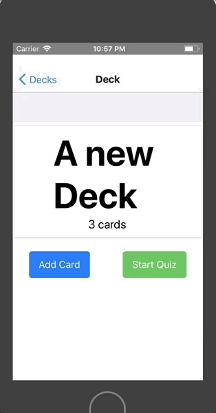

## Mobile Flashcards App

Tested in an iOS device ONLY.
A small mobile app done with React Native that allows users to study collections of flashcards. The app allow users to create different categories of flashcards called "decks", add flashcards to those decks, then take quizzes on those decks.


## Prerequisites

This software was built and tested with React Native on a Mac machine. Emulation was on an iPhone 5s

https://facebook.github.io/react-native

This project is tested on node v8.11.2 and v10.8.0, the latest version of XCode and Yarn 1.9.4.


## Installation
Yarn recommended. Tested with npm 6.2.0 no problems so far, but still could be some issues with npm.
```
npm install
npm start
```

or
```
yarn //or yarn install
yarn start
```

It can complain about been unable to start the server, if thats the case, follow the instructions and put this on your terminal and try  again.
```
sudo sysctl -w kern.maxfiles=5242880
sudo sysctl -w kern.maxfilesperproc=524288
````


## Use





## Warning about notification API

If by simulating the app on your iOS device, you got a notification about the Quiz app that keeps running after the simulation ends, then you should uncomment this bit in the file Quiz.js, line 15. Start any quiz in the app simulation and you should see the log in the console.

```
componentDidMount() {
  clearLocalNotification()
    .then(() => console.log("notifications cleared"))
}
```


## Built With

* [create-react-native-app](https://facebook.github.io/react-native/docs/getting-started.html) - A React Native ready to go basic configuration
* [Redux](http://redux.js.org/) - The Redux pattern.


## Authors

* **Alejandro Zamora Reed** - [AZreed](https://github.com/AZReed)


## Licensing

The source code is licensed MIT.


## Contribution

https://github.com/AZReed/mobile-flashcards/blob/master/CONTRIBUTING.md


## Aknowledgments

The instructions for this project were given by [Udacity](https://www.udacity.com/)